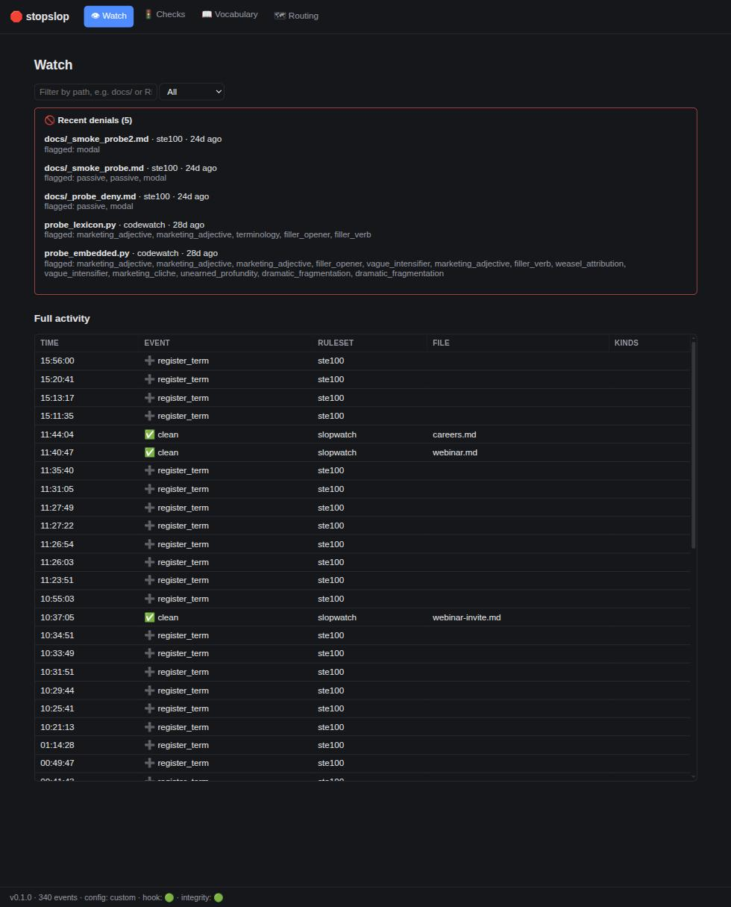
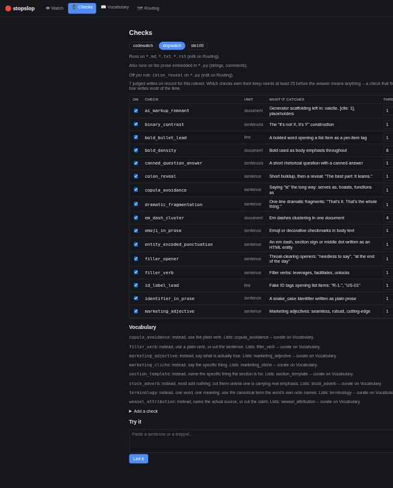
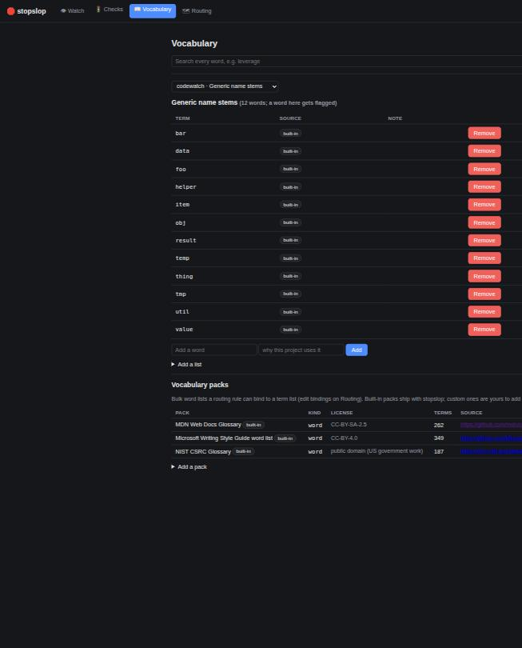
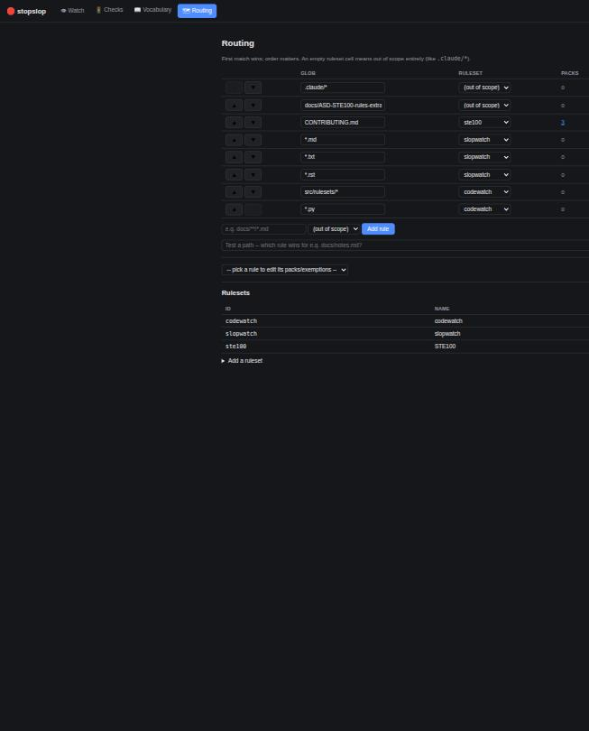

# Reading the dashboard

Four pages at `http://localhost:8501`, started by `python3 stopslop.py
dashboard` or on its own the first time an MCP session loads.

This page is written to be useful to a person looking at the screen and
to a model reading the file. Where the two need different things, the
model's version is under **For a model** and says which command does the
same job without a browser -- an agent should generally use the command,
because the dashboard's answers all come from files the CLI reads too.

Everything here edits `stopslop.config.json` and
`.claude/stopslop-history.log`, the same two files the gate, the CLI and
the MCP server use. There is no second store, and a change reaches the
next gate call with no restart.

---

## Watch -- what the gate has actually done

The activity feed, newest first, with recent denials called out at the
top in red.

Each row is one gate decision: when, what happened (`clean`, `deny`,
`auto_fix`, `register_term`), which ruleset judged it, which file, and
which checks fired. The filter box narrows by path; the dropdown narrows
by event kind.

**What to look for.** A long run of `deny` on one file means a check is
misfiring on that kind of writing, not that the writing is bad -- the
fix is usually a per-path exemption on Routing rather than a rewrite. A
feed with no `deny` at all and plenty of `clean` means the gate is
costing you nothing and catching nothing, which is worth knowing before
you conclude it is working.

The footer carries the three states worth checking at a glance: total
events, whether the config is the built-in default or a custom one, and
whether the hook and the integrity check are green.

**For a model:** `python3 stopslop.py status` prints the same counts and
the hook/venv/MCP wiring. `core.history.read_history` gives the raw
events.

---

## Checks -- which rules exist, and which ones earn their place

Pick a ruleset with the pills at the top. The table is one row per
check: on/off, its id, the unit it runs over (`sentence`, `document`,
`line`), what it catches, its threshold, its action (`warn` or `block`),
and how often it has actually fired.

**The column that matters is how often it fires.** This project measured
19 of slopwatch's 31 checks firing ZERO times across 59902 words of
generated prose, with six carrying 96% of every flag. A check that never
fires costs nothing at the gate and costs a reader attention every time
they read the list. The page stays quiet about it below 25 judged
writes, because a check that fires on one document in ten sits out a
four-write sample most of the time.

The line above the table tells you how many judged writes this ruleset
has on record, so you know whether the firing counts mean anything yet.

**Threshold** is a per-check number and its meaning is per-check too: on
a density check it counts occurrences before one flag is raised, on a
sentence check it counts flags a document may hold. **Action** decides
whether a flag denies a write or only annotates it.

"Add a check" opens a plain textarea for a real Python matcher. "Try it"
lints text through the exact gate a real write would hit.

**For a model:** `python3 stopslop.py checks --ruleset ID` lists the same
table; `--set-threshold CHECK=N` and `--set-action CHECK=block|warn`
change it. `python3 stopslop.py decay [PATHS]` answers the firing
question properly against a corpus, including the zeros, and
`--against PATH` answers the harder one: does this check fire more on
generated text than on writing you want to sound like?

---

## Vocabulary -- the words behind the checks

Some checks match a word list rather than a pattern. This page is those
lists.

The search box at the top searches every word in every list at once,
tagged by ruleset and source, which is the fastest way to answer "why
did this word get flagged". Below it, one list at a time: each term, its
source (`built-in`, a pack, or this project's own registration), and the
note explaining why a project registered it.

A built-in or pack word cannot be deleted, only suppressed, and it stays
restorable. Your own registrations can be removed outright. That
asymmetry is deliberate: a shipped list is someone else's judgment and
you are overriding it rather than editing it.

**Vocabulary packs** are bulk word lists -- the MDN glossary, the
Microsoft style guide list, the NIST security glossary -- with their
licences shown, because they carry other people's terms. A pack does
nothing until a routing rule binds it to a list, since a pack has no
opinion about where it applies.

**For a model:** `python3 stopslop.py terms --ruleset ID` lists the same
thing, `--add TERM --note "why"` registers one. `python3 stopslop.py
packs` shows packs and their bindings. `check_word` over MCP answers a
single lookup without a shell.

---

## Routing -- which ruleset judges which file

The rules table, in order, and **order decides everything**: first match
wins. The arrows reorder. An empty ruleset cell puts a path out of scope
entirely.

The path probe under the table answers "which rule wins for this file",
which is the only reliable way to check a glob -- a rule that looks
right can be shadowed by an earlier one, and this is how you find out.

The rule picker below binds vocabulary packs and per-rule check
exemptions to one rule, so a check can be off for `tests/**` and on
everywhere else. **Rulesets** at the bottom scaffolds a new ruleset from
an id and a name, renames one, or removes it -- refused while any rule
still routes to it.

**What to look for.** A rule you added that never fires is almost always
shadowed by a broader rule above it. Probe the path; do not read the
globs and reason about them.

**For a model:** `python3 stopslop.py list-rulesets` shows every ruleset
and the globs routed to it. `python3 stopslop.py rule-checks --glob GLOB`
reads and writes per-rule thresholds. `explain(file_path)` over MCP
answers what gates a file, what would block, and which checks run -- one
call instead of guessing a ruleset and then making four more.

---

## What the dashboard is not

It is not a second source of truth. Every page reads and writes the same
files the gate reads, so anything you can do here you can do from the
CLI, and an agent should prefer the CLI.

It is not a report on writing quality. Every number here counts flags,
and no flag count decides whether prose is good. The evaluation harness
in `src/evalab/` exists because that question needs a control group, and
even there the answer is only "does this still read as machine-written".
